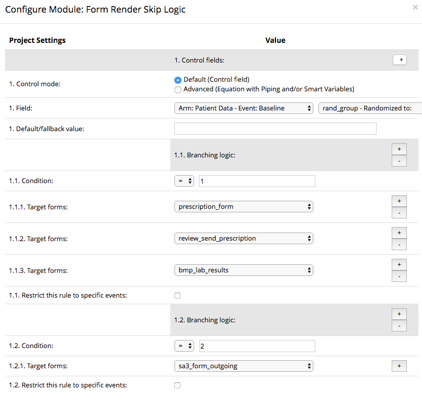

# REDCap Form Render Skip Logic (FRSL)

This REDCap module hides and shows instruments based on the value of a single field on a single form - i.e. a branching logic for instruments.

## Motivation
The original use case of this tool was to facilitate a data entry workflow specific to acute brain injury diagnoses, but the tools is generalized to support the hiding (and showing) of any number of forms based on a field value on one form.

See the functional specification at [https://docs.google.com/document/d/1Ej7vCNpKOrC6X9KVpkZkHeY0v2VqQXrjuMIBQtbj1bw/edit#](https://docs.google.com/document/d/1Ej7vCNpKOrC6X9KVpkZkHeY0v2VqQXrjuMIBQtbj1bw/edit) for functional details.

## Prerequisites
- REDCap >= 8.0.0 (for versions < 8.0.0, [REDCap Modules](https://github.com/vanderbilt/redcap-external-modules) is required).

## Installation
- Clone this repo into to `<redcap-root>/modules/form_render_skip_logic_v2.0`.
- Go to **Control Center > Manage External Modules** and enable Form Render Skip Logic.
- For each project you want to use this module, go to the project home page, click on **Manage External Modules** link, and then enable Form Render Skip Logic for that project.

## Configuration
Access **Manage External Modules** section of your project, click on Form Render Skip Logic's configure button, and save settings in order to show or hide instruments according to your needs. This process is very similar to REDCap branching logic.

The first entries in the form configuration set the Control Field.  The control field is described by an event name and a field name.  Together these two values define the precise which variable controls which set of forms will be displayed.

The subsequent configuration fields name forms that should be displayed for particular values of the control field. Add an entry nameing a form and the control field value for each form that needs to be limited to certain control field values.  You can add as many pairs for form name and file value as you need.  All forms _not_ named will be displayed at all times.

The image below shows a sample configuration where the control field is named `rand_group` and appears on the `Baseline` event of the `Patient Data` arm.  The first two forms will be displayed only when `rand_group = 1`. The last form will be displayed only when `rand_group = 2`.

